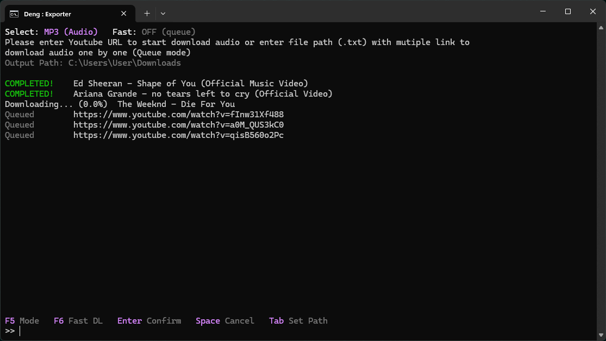

<div align="center">

# 🎧 Deng : Exporter

**A fast, good-looking terminal app for downloading YouTube audio & video.**
Built in Rust. Powered by `yt-dlp`. Zero setup.


<br>

<!-- Put your screenshot at docs/screenshot.png -->


</div>

---

## ✨ Features

| | Feature | Description |
|---|---|---|
| 🎨 | **Custom TUI** | Fully hand-rendered terminal interface using `crossterm` with TrueColor RGB. |
| 📦 | **Auto-install** | Missing `yt-dlp` or `ffmpeg`? Deng downloads and sets them up for you on first run. |
| 🎵 | **MP3 / MP4 modes** | Switch between audio and video with a single key. |
| 📃 | **Batch downloads** | Point it at a `.txt` file of links and let it work through the list. |
| ⚡ | **Queue & Fast modes** | Download one by one (Queue) or in parallel (Fast DL). |
| 📊 | **Live progress** | Real-time percentages and video titles for every item. |
| 🧭 | **Scrollable list** | Large batches scroll while the header and footer stay anchored. |
| 📁 | **Native folder picker** | Press `Tab` to choose your output folder in Windows Explorer. |
| 🛑 | **Instant cancel** | Stop active downloads at any time with `Space`. |

---

## 📋 Requirements

- **OS:** Windows 10 / 11
- **Terminal:** [Windows Terminal](https://aka.ms/terminal) (recommended, for TrueColor support)
- **Rust toolchain:** to build from source ([install Rust](https://www.rust-lang.org/tools/install))
- *(Optional)* `yt-dlp` and `ffmpeg`: if they aren't on your `PATH`, Deng installs them locally automatically.

---

## 🚀 Getting Started

```powershell
# 1. Clone the repository
git clone https://github.com/<your-username>/<your-repo>.git
cd <your-repo>

# 2. Build and run
cargo run --release
```

On first launch, Deng will fetch any missing dependencies. After that, just paste a link and go.

---

## 🎮 Controls

| Key | Action |
|:---:|---|
| `F5` | Toggle between **MP3 (Audio)** and **MP4 (Video)** |
| `F6` | Toggle **Fast DL** (parallel) on or off (Queue mode) |
| `Enter` | Confirm the URL or file path in the prompt |
| `Tab` | Open the folder picker to set the output path |
| `Space` | Cancel all active downloads |
| `↑` / `↓` | Scroll through the download list |

> 💡 Downloads are saved to your **Downloads** folder by default.

---

## 📥 Usage

### Single download

Paste a YouTube URL at the `>>` prompt and press `Enter`.

```text
>> https://www.youtube.com/watch?v=XXXXXXXXXXX
```

### Batch download

Create a `.txt` file with **one URL per line**:

```text
https://www.youtube.com/watch?v=XXXXXXXXXXX
https://www.youtube.com/watch?v=YYYYYYYYYYY
https://www.youtube.com/watch?v=ZZZZZZZZZZZ
```

Then enter the full path to the file at the prompt:

```text
>> C:\Users\User\Downloads\list.txt
```

### Queue vs. Fast mode

| Mode | Behavior | Best for |
|---|---|---|
| **Queue** (`Fast: OFF`) | Downloads items one at a time, in order | Stable, predictable runs |
| **Fast** (`Fast: ON`) | Downloads multiple items concurrently | Speed on big lists |

### Status indicators

| Status | Meaning |
|---|---|
| `Queued` | Waiting for its turn |
| `Downloading... (42.0%)` | In progress, with live percentage |
| `COMPLETED!` | Finished and saved |

---

## 🛠 Built With

- [Rust](https://www.rust-lang.org/): performance and safety
- [Tokio](https://tokio.rs/): async runtime for concurrent downloads
- [Crossterm](https://github.com/crossterm-rs/crossterm): cross-platform terminal control
- [Reqwest](https://github.com/seanmonstar/reqwest): automatic dependency fetching
- [yt-dlp](https://github.com/yt-dlp/yt-dlp) and [FFmpeg](https://ffmpeg.org/): the download and conversion engines

---

## 🤝 Contributing

Issues and pull requests are welcome. If you have an idea or found a bug, feel free to [open an issue](../../issues).

---

## ⚠️ Disclaimer & License

This project is for **educational purposes only**. Please respect YouTube's Terms of Service and the rights of content creators. Only download content you have permission to save.
